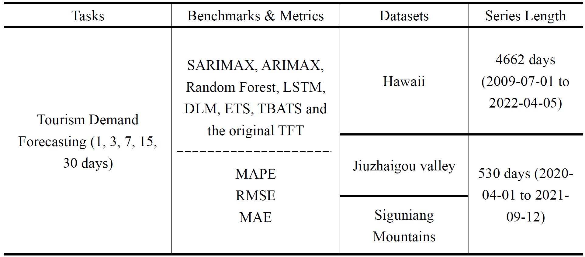

# Enhancing Tourism Demand Forecasting with a Transformer-based Framework

This study introduces an innovative framework that harnesses the most recent Transformer architecture to enhance tourism demand forecasting. The proposed transformer-based model integrates the tree-structured Parzen estimator for hyperparameter optimization, a robust time series decomposition approach, and a temporal fusion transformer for multivariate time series prediction. Our approach initially employs the decomposition method to decompose the data series to effectively mitigate the influence of outliers. The temporal fusion transformer is subsequently utilized for forecasting, and its hyperparameters are meticulously fine-tuned by a Bayesian-based algorithm, culminating in a more efficient and precise model for tourism demand forecasting. Our model surpasses existing state-of-the-art methodologies in terms of forecasting accuracy and robustness.

## Overview
This project employs the Temporal Fusion Transformer model for forecasting tourism demand. A unique aspect of this project is its preprocessing step where the 'tourist' data is decomposed into 'Trend', 'Seasonal', and 'Resid' components using the [RobustSTL](https://github.com/LeeDoYup/RobustSTL) model. These components are then used as individual targets for the forecasting model.

## Usage

### 1. Environment Setup
Before running the experiments, ensure your environment is set up with all the necessary Python libraries. You can install all the required libraries using the following command:

```
pip install -r requirements.txt
```

This command will automatically install the libraries listed in the requirements.txt file. Ensure you have a GPU setup for PyTorch, as the project is optimized to run on a GPU for faster training.

### 2. Prepare Data
The datasets have been pre-processed and are ready to use. You can find them in the `dataset` folder. All datasets have been enhanced with external variables and decomposed using RobustSTL for an optimized forecasting process. The 'Trend', 'Seasonal', and 'Resid' components have been adjusted to facilitate better model training. Here is a summary of datasets. 



The datasets are ready to be loaded using the `data_loader.py` script.

Before running the Python scripts, ensure that you navigate to the directory where the scripts are located. Use the `cd` command in your terminal or command prompt to change to the correct directory.
```
cd path_to_your_scripts_directory
```
Replace `path_to_your_scripts_directory` with the actual path to your scripts.

### 3. Decomposition with RobustSTL
Before training the TFT model, the dataset should be pre-processed using the RobustSTL decomposition model. This involves breaking down the 'tourist' column into three components: 'Trend', 'Seasonal', and 'Resid'. These components, when summed, reconstruct the original 'tourist' data. If you are working with your own dataset, please apply the RobustSTL decomposition in this step to prepare your data accordingly.

### 4. Train and Evaluate the Model
Use the prepare_train_model.py script to configure the model with specific features, hyperparameters, and training settings. 

For your convenience, we have compiled a summary of the hyperparameters used for different prediction lengths across all datasets. This comprehensive overview allows you to understand the model configurations that were utilized to achieve the best forecasting results.

The hyperparameter summary can be found in the `dataset` folder, under the name `hyperparameters_summary.xlsx`. This Excel file contains separate sheets for each dataset, detailing the hyperparameters for prediction lengths of 1, 3, 7, 15, and 30 days. These hyperparameters include gradient clipping value, hidden size, dropout rate, hidden continuous size, attention head size, and learning rate.

By exploring `hyperparameters_summary.xlsx`, you can get insights into how the models were fine-tuned for each specific forecasting horizon. This information could serve as a starting point for your model tuning or as a benchmark for further experimentation.

For the preparation and training of the model, we have outlined the key configurations in the `keyconfigurations.txt` file. This file includes essential parameters such as `max_prediction_length`, `max_encoder_length`, and various settings for the `TimeSeriesDataSet` configuration. These parameters are crucial in determining the model's behavior for different forecasting scenarios.

Users are encouraged to refer to the `keyconfigurations.txt` file for a comprehensive understanding of these settings. You can modify these configurations in the script to adapt the model to different forecasting scenarios and datasets, ensuring flexibility and adaptability for your specific needs.

**Command-line Arguments:**
- `--data_file`: Path to your data file.
- `--target_feature`: Target feature for the model (e.g., 'Trend', 'Seasonal', 'Resid').
- `--optimize_hyperparameters`: Enable hyperparameter optimization.
- Additional model hyperparameters (e.g., `--learning_rate`, `--hidden_size` , `--gradient_clip_val` , `--dropout` , `--hidden_continuous_size` , `--attention_head_size`).

**Execution Command:**
To train the model with default settings:
```
python prepare_train_model.py --data_file "path_to_your_data_file.xlsx" --target_feature "Trend" --learning_rate 0.01 --hidden_size 128
```
*Note: Similar to the above, you can use the system's Python interpreter or an interpreter from a virtual environment.*

After training, the model for each component ('Trend', 'Seasonal', 'Resid') is saved as `tft_model.ckpt`, and the script outputs the forecasted values for each component. The final forecast of tourism demand is the sum of these three components.

### 5. Example Run

Within the `run_example` folder, we have included Jupyter Notebooks that detail complete forecasting experiments conducted on the Hawaii, Jiuzhaigou, and Siguniangshan datasets, forecasting the next 3 days. To replicate these experiments, ensure you download all contents within this folder. Each notebook corresponds to a specific dataset and is named for clarity:

- `run_example_hawaii.ipynb`
- `run_example_jiuzhaigou.ipynb`
- `run_example_siguniang.ipynb`

To gain a clearer and more detailed understanding of the experimental procedure, please refer to the `run_example_hawaii.ipynb` file. It contains the full end-to-end process starting from data loading, preprocessing, model training, forecasting, and finally evaluating the performance of the forecasts.

By using these pretrained models, you can achieve the forecast accuracy and results presented in our paper without the need to retrain the models from scratch.
